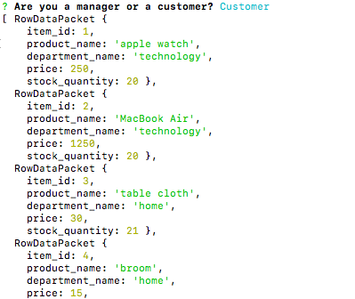
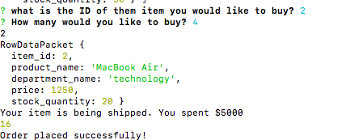
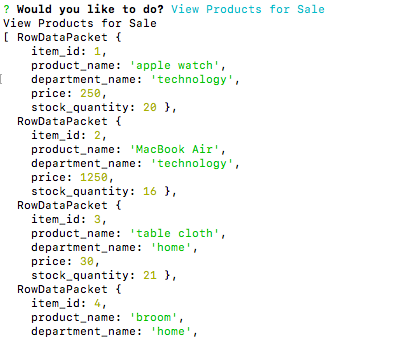
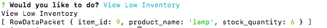
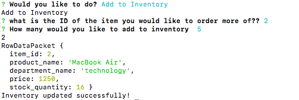
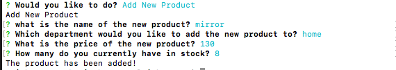

# bamazon

## **This command line application allows a customer to buy products from Bamazon and allows a manager to view and update product information** 

It allows a customer to:

* view products in stock

* purchase mulitple products 

* see how much money they spent 

It allows a manager to: 

* view products in stock

* view products with low inventory

* Add to inventory for a specific product 

* Add a new product

## **First is will have you select if you are a customer or manager ** 

## **CUSTOMER** 

If you are a customer, it will show you available products: 

It will then ask what is the ID of the product you would like to purchase and how many. It will show if the purchase was successful. It also calculates your total: 

 ## **MANAGER** 

If you are a manager, it will ask you what you would like to do: 

If you select "View Products for Sale", it will display all the product information: 

If you select "View Low Inventory", it will display products will low inventory: 

If you select "Add to Iventory", it will ask a series of questions in order to add to the inventory: 

Lastly, if you select "Add New Product", if will ask a series of questions in order to add the new product: 

